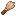

# Completed Item Guide

[Go back](../README.md#item-guide)

Here you will find a list of all the artefacts and how to obtain them.

<ul>
    <li><a href="#crafted-artefacts">Crafted Artefacts</a></li>
    <li><a href="#common-artefacts">Common Artefacts</a></li>
    <li><a href="#uncommon-artefacts">Uncommon Artefacts</a></li>
    <li><a href="#rare-artefacts">Rare Artefacts</a></li>
    <li><a href="#epic-artefacts">Epic Artefacts</a></li>
</ul>

## Crafted Artefacts

Crafted artefacts are **consumables** that can easily be obtained via crafting.

They can also be found as Common Artefacts in chests.

|                                                        | Name                                     | Description | Obtained via: |
|--------------------------------------------------------|------------------------------------------|-------------|---------------|
|                                | Air Bubble                               | Grants Water Breathing for 2 seconds. |  Crafting |
|                           | Flask of Glowing                         | Grants Glowing for 10 seconds. |  Abandoned Mineshafts  Crafting  Monster Rooms |
|                        | Flask of Regeneration                    | Grants Regeneration II for 10 seconds. |  Abandoned Mineshafts  Crafting  Monster Rooms |
|                        | Milk Chocolate Bar                       | Clear all effects. |  Crafting |
|                           | Strong Flask of Glowing                  | Grants Glowing for 1 minute. |  Crafting  Monster Rooms |

## Common Artefacts

Common artefacts are **consumables** that can be obtained in a **large quantity**.

|                                                        | Name                                     | Description | Obtained via: |
|--------------------------------------------------------|------------------------------------------|-------------|---------------|
|               | Long-Range Artillery Firework Rocket     | Carries 5 Firework Stars and with flight duration of 3. |  Trial Chambers - Supply  Trial Chambers - Vault - Common Reward |
|               | Medium-Range Artillery Firework Rocket   | Carries 6 Firework Stars and with flight duration of 2. |  Trial Chambers - Supply  Trial Chambers - Vault - Common Reward |
|               | Short-Range Artillery Firework Rocket    | Carries 7 Firework Stars and with flight duration of 1. |  Trial Chambers - Supply  Trial Chambers - Vault - Common Reward |

## Uncommon Artefacts

Uncommon artefacts are easily obtainable **low-impact** items.

|                                                        | Name                                     | Description | Obtained via: |
|--------------------------------------------------------|------------------------------------------|-------------|---------------|
|                             | Battle Shield                            | Can be used as both a shield and a weapon. |  Bastions - Hoglin Stables  Trial Chambers - Vault - Rare Reward |
|                                | Cat Ears                                 | Grants 1 block of additional safe fall distance. |  Cats - Morning Gift  Fishing - Treasure  Villages - Tannery |
|                             | Charm of the Axolotl                     | Grants 2 additional hearts. |  Shipwrecks - Treasure  Underwater Ruins |
|                             | Charm of the Chicken                     | Grants 1 block of additional safe fall distance. |  Cats - Morning Gift |
|                             | Charm of the Strider                     | Nullifies burning time. |  Piglins - Bartering |
|                            | Crystal of Origin                        | Removes enchantments and curses from an item. |  Ancient Cities  End Cities  Strongholds - Library |
|                | Enchanted Book - Imperilment             | Grants additional attack damage to armors, but cannot be combined with Protections. |  Bastions - Treasure  Woodland Mansions
|   | Fisherman Armor            | Increases luck. |  Fishing - Treasure
|                 | Music Disc - Groovotational              | |  Jungle Temples  Monster Rooms  Woodland Mansions
|     | Music Disc - Moment Of Melting Solitude  | |  Jungle Temples  Monster Rooms  Woodland Mansions
|                   | Music Disc - Space Caster                | |  Jungle Temples  Monster Rooms  Woodland Mansions
|                            | Repair Crystal                           | Repairs an item. |  Abandoned Mineshafts  Monster Rooms  Strongholds - Library  Villages - Armorer, Toolsmith and Weaponsmith
|                         | Swamp Camoufalge Tunic                   | Is enchanted with Poison Immunity. |  Fishing - Treasure - Swamp and Mangrove Swamp  Jungle Temples  Trial Chambers - Vault - Rare Reward
|                          | Very Convincing Disguise                 | Is enchanted with Incognito, granting Invisibility. | Abandoned Mineshafts  Pillager Outposts

## Rare Artefacts

Rare artefacts are **high-impact** items that can be **hard to obtain**.

|                                                        | Name                                     | Description | Obtained via: |
|--------------------------------------------------------|------------------------------------------|-------------|---------------|
|                             | Charm of the Ravager                     | Grants 1 of attack knockback. |  Woodland Mansions
|                          | Drilling Pickaxe                         | Efficient but really fragile. |  Abandoned Mineshafts  Trial Chambers - Ominous Vault - Rare Reward  Trial Chambers - Vault - Unique Reward
|                   | Enchanted Book - Fracture                | Grants a Slowness effect to axes. |  Bastions - Treasure  Woodland Mansions
|   | Little Armor                        | Grants a reduced size. |  Trial Chambers - Ominous Vault - Rare Reward
|     | Piglin Armor | Grants additional attack damage. |  Bastions - Treasure
|     | Sniffer Armor | Grants additional knockback resistance. |  Trail Ruins - Rare Reward
|     | Warden Armor | Grants additional hearts. |  Ancient Cities

## Epic Artefacts

Epic artefacts are **high-impact** end-game items.

|                                                        | Name                                     | Description | Obtained via: |
|--------------------------------------------------------|------------------------------------------|-------------|---------------|
|                           | Charm of the Endermite                   | Halves the size but nullifies armor toughness. |  End Cities
|              | Enchanted Book - Call to Chaos           | Grants random potion effects after attacking with a weapon. |  Igloos
|                  | Enchanted Book - Vampirism               | Grants Regeneration after attacking with a weapon. |  Trial Chambers - Ominous Vault - Rare Reward
|                                | Ender Hand                               | Grants 5 of attack knockback. |  End Cities
|                   | Netherite Battle Shield                  | Can be used as both a shield and a weapon. |  Bastions - Treasure