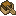
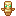

# Completed Item Guide

[Go back](../README.md#item-guide)

Here you will find a list of all the artefacts and how to obtain them.

<a href="#common-artefacts">Common Artefacts</a>

<ul>
    <li><a href="#long-range-artillery-firework-rocket">Long-Range Artillery Firework Rocket</a></li>
    <li><a href="#medium-range-artillery-firework-rocket">Medium-Range Artillery Firework Rocket</a></li>
    <li><a href="#short-range-artillery-firework-rocket">Short-Range Artillery Firework Rocket</a></li>
</ul>

<a href="#uncommon-artefacts">Uncommon Artefacts</a>

<ul>
    <li><a href="#battle-shield">Battle Shield</a></li>
    <li><a href="#cat-ears">Cat Ears</a></li>
    <li><a href="#charm-of-the-axolotl">Charm of the Axolotl</a></li>
    <li><a href="#charm-of-the-chicken">Charm of the Chicken</a></li>
    <li><a href="#fishermans-bucket-hat">Fisherman's Bucket Hat</a></li>
    <li><a href="#fishing-jacket">Fishing Jacket</a></li>
    <li><a href="#music-disc---space-caster">Music Disc - Space Caster</a></li>
</ul>

<a href="#rare-artefacts">Rare Artefacts</a>

<ul>
    <li><a href="#charm-of-the-ravager">Charm of the Ravager</a></li>
    <li><a href="#charm-of-the-strider">Charm of the Strider</a></li>
    <li><a href="#drilling-pickaxe">Drilling Pickaxe</a></li>
    <li><a href="#little-feet">Little Feet</a></li>
    <li><a href="#little-legs">Little Legs</a></li>
</ul>

<a href="#epic-artefacts">Epic Artefacts</a>

<ul>
    <li><a href="#charm-of-the-endermite">Charm of the Endermite</a></li>
    <li><a href="#ender-hand">Ender Hand</a></li>
</ul>

## Common Artefacts

Common artefacts are **consumables** that can be obtained in a **large quantity**.

### Long-Range Artillery Firework Rocket

Obtained via:

-  Trial Chambers - Supply
-  Trial Chambers - Vault - Common Reward

### Medium-Range Artillery Firework Rocket

Obtained via:

-  Trial Chambers - Supply
-  Trial Chambers - Vault - Common Reward

### Short-Range Artillery Firework Rocket

Obtained via:

-  Trial Chambers - Supply
-  Trial Chambers - Vault - Common Reward

## Uncommon Artefacts

Uncommon artefacts are easily obtainable **low-impact** items.

### Battle Shield

Obtained via:

-  Trial Chambers - Vault - Rare Reward

### Cat Ears

Obtained via:

-  Cats - Morning Gift
-  Fishing - Treasure
-  Villages - Tannery

### Charm of the Axolotl

Obtained via:

-  Shipwrecks - Treasure
-  Underwater Ruins

### Charm of the Chicken

Obtained via:

-  Cats - Morning Gift
-  Hero of the Village - Gift - Farmer

### Fisherman's Bucket Hat

Obtained via:

-  Fishing - Treasure

### Fishing Jacket

Obtained via:

-  Fishing - Treasure

### Music Disc - Space Caster

Obtained via:

-  Jungle Temples
-  Woodland Mansions

## Rare Artefacts

Rare artefacts are **high-impact** items that can be **hard to obtain**.

### Charm of the Ravager

Obtained via:

-  Hero of the Village - Gift - Weaponsmith
-  Woodland Mansions

### Charm of the Strider

Obtained via:

-  Piglins - Bartering

### Drilling Pickaxe

Obtained via:

-  Trial Chambers - Ominous Vault - Rare Reward
-  Trial Chambers - Vault - Unique Reward

### Little Feet

Obtained via:

-  Trial Chambers - Ominous Vault - Rare Reward

### Little Legs

Obtained via:

-  Trial Chambers - Ominous Vault - Rare Reward

## Epic Artefacts

Epic artefacts are **high-impact** end-game items.

### Charm of the Endermite

Obtained via:

-  End Cities

### Enchanted Book - Vampirism

Obtained via:

-  Trial Chambers - Ominous Vault - Rare Reward

### Ender Hand

Obtained via:

-  End Cities

### Netherite Battle Shield

Obtained via:

-  Bastions - Treasure